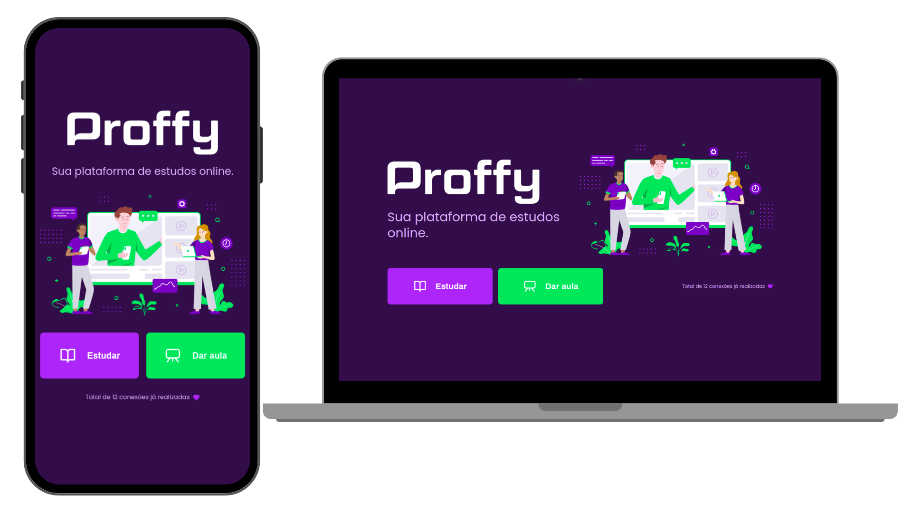

<p align="center">
  
  <br><br>
</p>

<h1 align="center">Sua plataforma de estudos online</h1> 
<div align="center">
<br><br>
<div>
  
</div>
<br><br>

💻 **Acesse o Front-end [aqui](https://github.com/CCastro01/proffy_omnistack-NLW-2/tree/master/web)** | 
🖥 **Acesse o Back-end [aqui](https://github.com/CCastro01/proffy_omnistack-NLW-2/tree/master/server)** | 
📱 **Acesse o Mobile [aqui](https://github.com/CCastro01/proffy_omnistack-NLW-2/tree/master/mobile)** |
</div>
<br><br>


## 📑 Índice

- [Sobre o Projeto](#-sobre-o-projeto)
- [Tecnologias utilizadas](#-tecnologias-utilizadas)
- [Executar na sua máquina](#Executar-na-sua-máquina)
- [Licença](#-licença)
<br><br>
## 💡 Sobre o Projeto

O **Proffy** é uma aplicação Web e Mobile feita para auxiliar na conexão entre os alunos e os professores. Logo, esta aplicação oferece aos professores a possibilidade de registrar aulas, podendo adicionar informações como a disciplina, o custo e horário e aos alunos a possibilidade de buscar pelas aulas cadastradas.
  
Este projeto foi idealizado pensando no **6 de agosto**, onde se comemora o **Dia Nacional dos Profissionais da Educação**.
  
Essa aplicação foi realizada durante a Next **Level Week #2**, projeto da [Rocketseat](https://rocketseat.com.br/).

<br>

## 🚀 Tecnologias utilizadas

O projeto foi desenvolvido utilizando as seguintes tecnologias:

- ReactJS
- React Native
- TypeScript
- HTML5 e CSS3
- NodeJS
<br><br>


## 📥 Executar na usa máquina

- Clonar Repositório: `git clone https://github.com/CCastro01/proffy_omnistack-NLW-2`

```sh
  # API
  $ cd server
  # Instalando as dependências do projeto.
  $ yarn # ou npm install
  # Configurando o banco de dados e criando as tabelas.
  $ yarn knex:migrate # ou npm run knex:migrate

  # Inicie a API
  $ yarn start # ou npm start

  # Aplicação web
  $ cd web
  # Instalando as dependências do projeto.
  $ yarn # ou npm install
  # Inicie a aplicação web
  $ yarn start # ou npm start

  # Aplicação mobile
  $ cd mobile
  # Instalando as dependências do projeto.
  $ yarn # ou npm install
  # Inicie a aplicação mobile
  $ yarn start # ou npm start
```

<br><br>    
## 📕 Licença

Todos os arquivos incluídos aqui, incluindo este _README_, estão sob [Licença MIT](./LICENSE).<br>
Criado com ❤ por [Christian Castro](https://github.com/ccastro01)